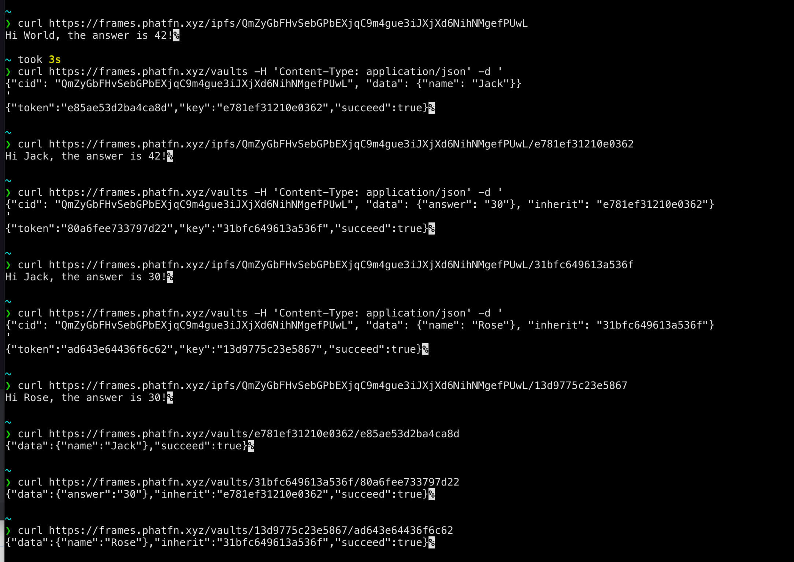

# Phat Frames Gateway

Proven of concept implementaion that mapping a generic HTTP request to specified Phat Contract offchain query. 

## Why

- **NOT Everyone use same language**. We need an adapter that ensure the communication is smooth.
- We need balancing how much data is unencrypted.
- Learning Rust & Ink Contract is hard, maybe you just need write a few lines of JavaScript, deploy to IPFS, and done.

Phat Frames Gateway is the solution that convert typical HTTP request into Phat Contract Query, then you can use the decentralized computing node with confidence.

## Up & Run

The demo wrotten in [TypeScript](https://www.typescriptlang.org/) and runs with [bun](https://bun.sh/). We also need [Redis](https://redis.com) for caching, e.g. caching the JavaScript files from IPFS.

```shell
bun i
cp .env.example .env
bun run bun.js
```

The default `.env.example` configured to use Phala PoC6 testnet.

## Usage

We already deploy an instance on https://agents.phala.network , give it a try: https://agents.phala.network/ipfs/QmZyGbFHvSebGPbEXjqC9m4gue3iJXjXd6NihNMgefPUwL


### `GET|POST /ipfs/<cid>/<secret_key>?` 

Execute the JS script save on ipfs. `<cid>` is the file CID. *We don't support folder over ipfs.* `<secret_key>` is optional, and it's associated with `<cid>`, so your secret data only can access via associate `<cid>`.

Example:
- https://agents.phala.network/ipfs/Qmf45SsHFXXXTLG1Fv47jp1d8YR5po2LP1V9HJqoL1Nz6B/0
- https://agents.phala.network/ipfs/Qmf45SsHFXXXTLG1Fv47jp1d8YR5po2LP1V9HJqoL1Nz6B/0?key=83240db6ccda883c


### `POST /vaults`

Create a secret. The cURL example:

```
curl https://agents.phala.network/vaults -H 'Content-Type: application/json' -d '{"cid": "Qmf45SsHFXXXTLG1Fv47jp1d8YR5po2LP1V9HJqoL1Nz6B/0", "data": {"name": "Jack"}}'
```

It returns JSON contains `token` and `key`. `key` is use for specified secret in URL, and `token` is for inspection. For example we got response like:

```
{"token":"e85ae53d2ba4ca8d","key":"e781ef31210e0362","succeed":true}
```

You can compose the URL with the `key`: https://agents.phala.network/ipfs/Qmf45SsHFXXXTLG1Fv47jp1d8YR5po2LP1V9HJqoL1Nz6B/0?key=e781ef31210e0362

You can also derive from an existing secret key:
```
curl https://agents.phala.network/vaults -H 'Content-Type: application/json' -d '{"cid": "Qmf45SsHFXXXTLG1Fv47jp1d8YR5po2LP1V9HJqoL1Nz6B/0", "data": {"name": "Rose"}, "inherit": "31bfc649613a536f"}'
```


### `GET /vaults/<key>/<token>`

Inspect a secret. The key and token should be matched. Example:

```
curl https://agents.phala.network/vaults/e781ef31210e0362/e85ae53d2ba4ca8d
```

### `POST /ipfs`

IPFS pinned service.

```
curl -F file=@examples/use-vaults/dist/index.js https://agents.phala.network/ipfs
```


## About Secret Derive

A screenshot show the secert derive concept.


